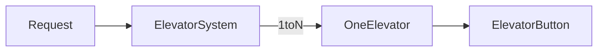
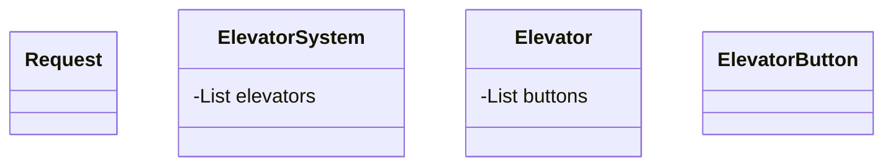
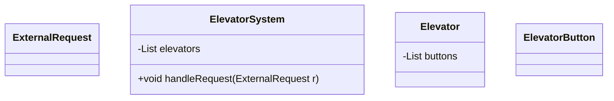
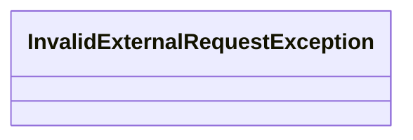
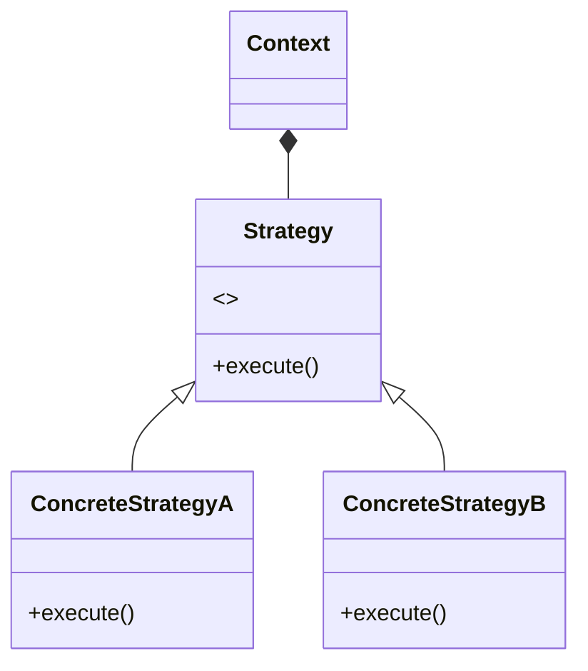

# SOLID

### Single Responsibility

> SOLID当中的S， 代表的是Single Responsibility Principle (SRP), 指的是设计当中的每个类，应该都有自己明确的职责，从而使得每个类，都应该有且只有一个改变它的理由。SRP也是实现高内聚(high cohesion)的一个重要原则。

### Open Close

- open to extension, close to modification

- 一個對象或實體應該對擴展開放，修改是封閉

- 如AreaCalculator 不該視不同的形狀在加不同的API，而是該傳入抽象Shape Interface實做 getArea()

  

### Liskov substitution & Interface Segregation

- 子類應該要可以替換父類
- 如機器人繼承人類就不好，不能吃喝拉撒
- 如 Shape裡要是有計算體積跟面積的abstract method, 就不該直接讓Rectangle繼承，不然不合理，最好是中間再插一層2D Shape後再給Rectangle繼承，就是可以分為平面跟立體的Shape做

#### Interface Segregation

- 機器人用不上人的吃喝拉撒 interface，就不該讓它實踐人的這些功能

> - 可以这样理解吗： SingleResponsibility 是为了解决后续维护中class过于臃肿的原则，InterfaceSegragation 是为了解决面向外部调用者让其他开发人员更容易明白不同接口的功能区别而总结的原则。
>   - Yes
> - 接口分离是什么？
>   - 假设现在我们有一个interface提供给用户，但是里面有**太多用户不需要的功能，显得我们的interface过于臃肿**；那么这时候我们就要把这个大的接口根据功能再次细分，然后提供给***不同的用户***。这就叫接口分离。

### Dependency Inversion 

- high level不該依賴於 low level實體這類的具體的實現
  - 如AreaCalculator裡不該依賴「三角形」，而是該依賴「Shape」這個抽象的東西，而別依賴「具體」的low level實體。
  - 讓大家的設計的dependency

# 5C Analyzation

- Clarify
  - What, how
  - Elevator 
    - Scheduler
- Core Object
  - Input, output, mapping 
- Cases
  - 需要支持哪些功能？

## Clarify

what, how

## Core Objects

​									↓

> #### [Visibility](https://mermaid-js.github.io/mermaid/#/classDiagram?id=visibility)
>
> To specify the visibility of a class member (i.e. any attribute or method), these notations may be placed before the member's name, but it is optional:
>
> - `+` Public
> - `-` Private
> - `#` Protected
> - `~` Package/Internal

> ##### [多选题]在设计电梯系统的Core Object时，需要考虑哪些Object之间的对应关系？
>
> A.Request 和 Elevator System 之间的关系34.18% 选择
>
> B.Elevator System 和 Elevator 之间的关系34.72% 选择
>
> C.Elevator 和 Elevator Button 之间的关系31.10% 选择
>
> ![img](data:image/svg+xml;base64,PD94bWwgdmVyc2lvbj0iMS4wIiBzdGFuZGFsb25lPSJubyI/PjwhRE9DVFlQRSBzdmcgUFVCTElDICItLy9XM0MvL0RURCBTVkcgMS4xLy9FTiIgImh0dHA6Ly93d3cudzMub3JnL0dyYXBoaWNzL1NWRy8xLjEvRFREL3N2ZzExLmR0ZCI+PHN2ZyB0PSIxNTM0MTgxMjgxODM5IiBjbGFzcz0iaWNvbiIgc3R5bGU9IiIgdmlld0JveD0iMCAwIDEwMjQgMTAyNCIgdmVyc2lvbj0iMS4xIiB4bWxucz0iaHR0cDovL3d3dy53My5vcmcvMjAwMC9zdmciIHAtaWQ9IjM3NjIiIHhtbG5zOnhsaW5rPSJodHRwOi8vd3d3LnczLm9yZy8xOTk5L3hsaW5rIiB3aWR0aD0iMzIiIGhlaWdodD0iMzIiPjxkZWZzPjxzdHlsZSB0eXBlPSJ0ZXh0L2NzcyI+PC9zdHlsZT48L2RlZnM+PHBhdGggZD0iTTUxOC4xMiA1MTYuMTZtLTQ5MCAwYTQ5MCA0OTAgMCAxIDAgOTgwIDAgNDkwIDQ5MCAwIDEgMC05ODAgMFoiIGZpbGw9IiM1NkI0MzIiIHAtaWQ9IjM3NjMiPjwvcGF0aD48cGF0aCBkPSJNMzkzLjIxMzYxOSA2NjQuMzM1NDk1bTI4LjI4NDI3MS0yOC4yODQyNzFsMjk2Ljk4NDg0OS0yOTYuOTg0ODQ4cTI4LjI4NDI3MS0yOC4yODQyNzEgNTYuNTY4NTQyIDBsMCAwcTI4LjI4NDI3MSAyOC4yODQyNzEgMCA1Ni41Njg1NDJsLTI5Ni45ODQ4NDggMjk2Ljk4NDg0OHEtMjguMjg0MjcxIDI4LjI4NDI3MS01Ni41Njg1NDMgMGwwIDBxLTI4LjI4NDI3MS0yOC4yODQyNzEgMC01Ni41Njg1NDJaIiBmaWxsPSIjRkZGRkZGIiBwLWlkPSIzNzY0Ij48L3BhdGg+PHBhdGggZD0iTTI4OS40Njk4NCA0NTIuODQ3ODgzbTI4LjI4NDI3MSAyOC4yODQyNzFsMTU1LjU2MzQ5MiAxNTUuNTYzNDkycTI4LjI4NDI3MSAyOC4yODQyNzEgMCA1Ni41Njg1NDNsMCAwcS0yOC4yODQyNzEgMjguMjg0MjcxLTU2LjU2ODU0MyAwbC0xNTUuNTYzNDkxLTE1NS41NjM0OTJxLTI4LjI4NDI3MS0yOC4yODQyNzEgMC01Ni41Njg1NDNsMCAwcTI4LjI4NDI3MS0yOC4yODQyNzEgNTYuNTY4NTQyIDBaIiBmaWxsPSIjRkZGRkZGIiBwLWlkPSIzNzY1Ij48L3BhdGg+PC9zdmc+)答对了，您选择的答案是ABC
>
> **正确答案:**ABC
>
> **解析:**
>
> 在考虑电梯问题时，把Request可以看成是输入
>
> 可以把Elevator看成Elevator System的输出
>
> 一个电梯会有很多的按钮，所以Elevator 和 Elevator Button 之间存在联系v

## Cases

> - 所以为啥不建一个elevator gate 和一个weight sensor 然后和这个elevator 来11对应呢
>   - 如果过分的追求单一功能原则反而会让各种class看上去shi'fen'yong'zhong

> 在UML类图当中，每个方法和属性都会用前缀修饰符来表示其访问级别。若没有前缀修饰符则代表此方法或属性属于Package内都可访问，在不同Package内不能直接访问。若有修饰符：'+'表示Public，代表此方法或属性公开，能在任何地方都能直接访问；'-'表示Private，代表此方法或属性私有 ，只能通过类内部访问；'#'表示Protected，代表此方法或属性为保护，在同一个Package内可以访问，在另一个Package内需要通过子类继承才能进行访问。

## Class

|       Use cases       |
| :-------------------: |
|    Handle request     |
| Take external request |
| Take internal request |
|       Open gate       |
|      Close gate       |
|     Check weight      |
|     Press button      |

> - 所以为什么handle 这个function是public? 什么叫use case是外部的？use case 莫非还有内部的？
>   - 外部的就是指别的class调用当前的class，内部的就是指自己class内部进行调用。

> 但是我们也知道，一部电梯，不一样时段人流量是不同的；比如上下班高峰期会有很多人使用，而晚上下班后可能使用频率就没有那么高。对于这种情况，我们又可以如何去改进我们的设计呢？这里给大家介绍这个课程里我们要学的第一个Design Pattern ——— Strategy Design Pattern。

## Strategy Design Pattern

- 封装了多種算法、策略
- 使得算法/策略之間能互相替換，也方便擴展

%	class ConcreteStrategyA{+execute()}
%	class ConcreteStrategyB{+execute()}

# QA

