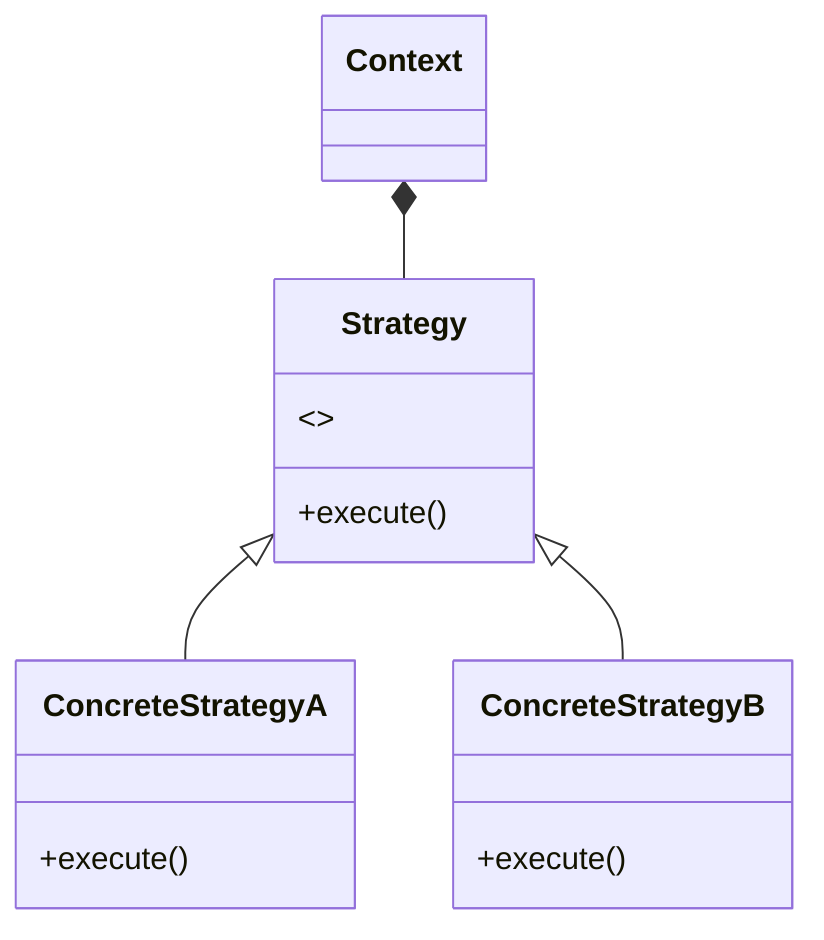
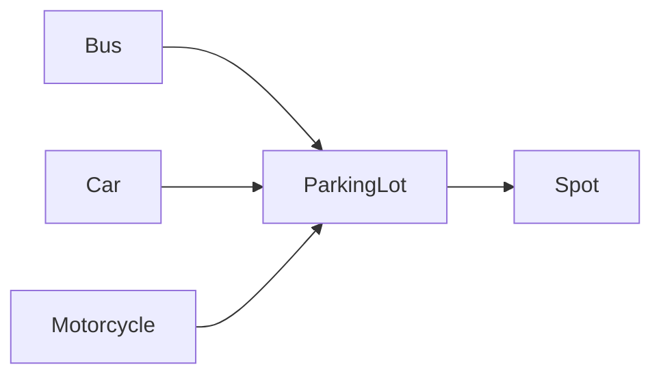
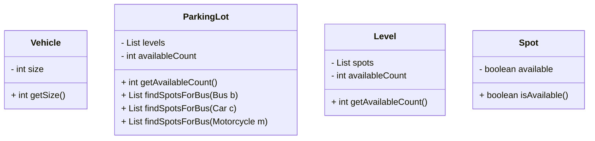
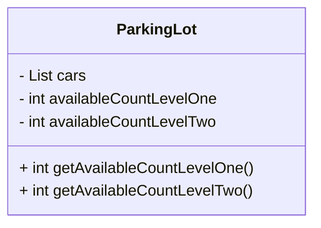
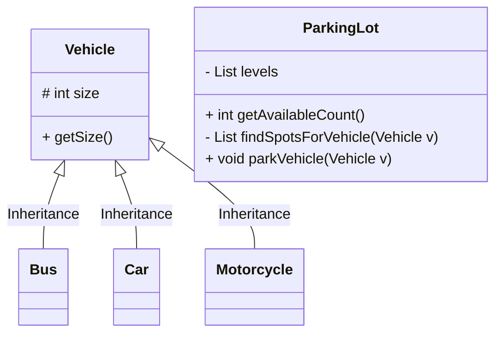
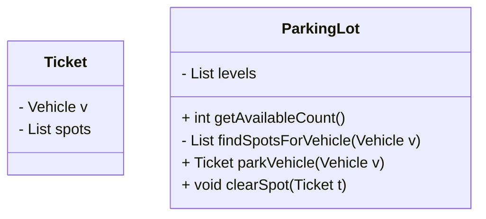
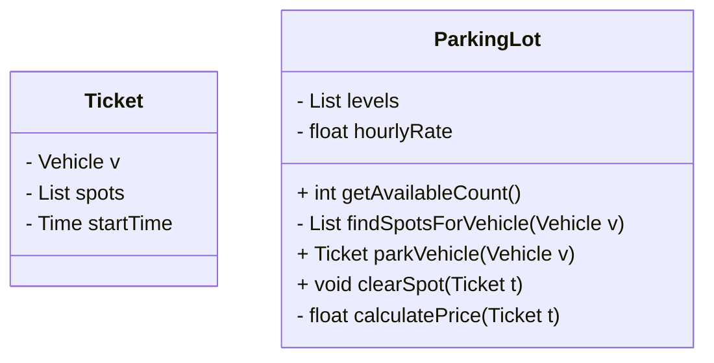
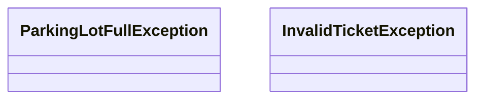
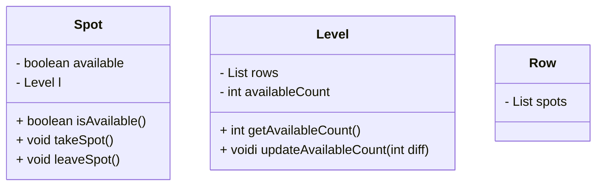
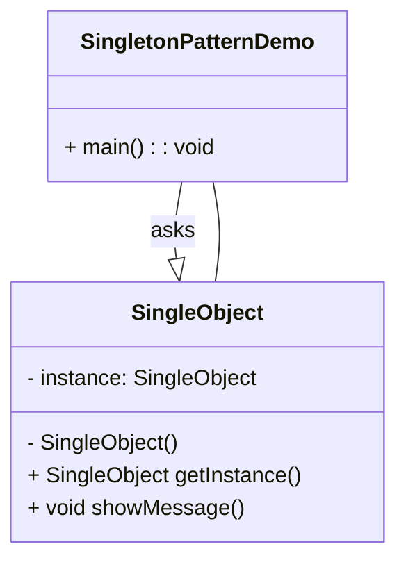

# Strategy Pattern




# Management OOD

- Gym 
- Parking lot
- Restaurant
- Library
- Super market
- Hotel

-- 模擬管理員的日常工作


## Clarify

- parking lot
- vehicle


## Core Object

- input?
- output?
- Elevator: Input: request; Output: elevator


## Case

- Reserve
- Serve
- Checkout


## Class

- 收據形式以保管information
- 例子：圖書館管理裡別用User Class包個Book的list或Book Class 包個User；比較好是用個收據單紀錄哪個人借了什麼書


# Design Parking lot

## Clarify

- What, How, Who

  - 要管理什么？input? output?
  - Key words: parking lot、vehicle、parking spot 
  - data member 性質的可不多考慮

  ```mermaid
  graph LR
  	A[Vehicle] --> B[ParkingLot] --> C[Parking Spot]
  ```


### Challenge

- keywords 的各種種類的區別

  - parking lot 類別

    - 露天：parking lot -> parking spaces
    - 停車塔多層樓: parking lot -> parking level -> parking spaces
    - 室內機械室: parking lot -> parking level (optional) ->  ->parking spaces -> Upper/Lower space

  - vehicle 類別

    不同種類的車對設計的影響？

    - Bus, 
    - car, 
    - motorcycle

  - parking spot 類別

    - 殘疾人
    - 充電車位

- 針對本題:

  - 考慮多層的Parking lot 沒錯層，考慮三種大小的車、不考慮殘疾、充電車位
  - 當尋找合適車位時，要看是否為空　vs 特製化車位，彈性低不易擴展


How: 

- 如何車？
  - 已知信息：所有車位都是相同規格的
- 角度：
  - 從車：開進停車場->經過每個位置看能否停->停進一個位置
  - 從停車場: 開進停車場->返回一個能停的地方->停進一個位置
- 規則：
  1. 停車
  2. 收費
- 假設針對時間收費


## Core Object

- What, Why, How
- Core Ojbects 之間的 mapping 關係




- Bad Desigs:　↓　

  ```mermaid
  classDiagram
  	class ParkingLot
  	ParkingLot: - List<Car> cars
  ```

  ```mermaid
  classDiagram
  	class Spot
  	Spot: - Car car
  ```

  

  - 不好的原因：
    1. 停車場不可能去知道是不是停了什麼顏色的什麼車
    2. Parking lot跟 Spot 都是靜態的Class, Car是個動態的東西；可以說Parking log 包含 spot；但靜態包動態的不好，停完車就出來了，車裡面放spot也無理
    3. 如果spot加了car也是加了一個不必要的dependency:
       - 假設Spot可叫讓Car拿他的車牌號叫get_plate()；但有天get_plate名字換了，Spot裡面的呼呼也要跟著變，但這是不合理的。
       - 不必須的dependency, ParkingLot現在depend在Car, 把 cars刪了會無法 compile；車子的操作改變跟停車場沒鳥關係
    4. 比較好是ParkingLog跟Splot有關係，用個parking ticket作紀錄，讓停車場去抽取這個關係就好


## Cases (Use Case)

- What, Why, How --  一份將做完的事的合約

- 根據類作思考，把自己想成是個去停車的人或把自己想像成自己是停車場 -- Better!

1. 車子 - 沒user Cases
2. Parking Lot 's features'
   - Get available count
   - Park vehicle
   - Clear spot
   - Calculate price
3. Spot 
   - N/A 

### Management 常見 User Case:

- Reservation: X
- **Serve: Park vehicle**
- **Check out: Clear spot + Calculate price**


## Class

- What, Why -- 可交遞的東西, How -- ?


​	

|       Use Cases       |
| :-------------------: |
| *Get available count* |
|     Park vehicle      |
|      Clear Spot       |
|    Calculate price    |





### Use Case: Get available counts



違背 O 原則


- 比較好是建一個Level類來管理。

> ##### [单选题]视频中Bus，Car，Motorcycle的抽象类Vehicle有哪些成员变量和成员函数，如何定义？
>
> A.`- int size,+ int getSize()`8.05% 选择
>
> B.`# int size,+ int getSize()`87.71% 选择
>
> C.`- int size, # int getSize()`4.24% 选择
>
> ![img](data:image/svg+xml;base64,PD94bWwgdmVyc2lvbj0iMS4wIiBzdGFuZGFsb25lPSJubyI/PjwhRE9DVFlQRSBzdmcgUFVCTElDICItLy9XM0MvL0RURCBTVkcgMS4xLy9FTiIgImh0dHA6Ly93d3cudzMub3JnL0dyYXBoaWNzL1NWRy8xLjEvRFREL3N2ZzExLmR0ZCI+PHN2ZyB0PSIxNTM0MTgxMjgxODM5IiBjbGFzcz0iaWNvbiIgc3R5bGU9IiIgdmlld0JveD0iMCAwIDEwMjQgMTAyNCIgdmVyc2lvbj0iMS4xIiB4bWxucz0iaHR0cDovL3d3dy53My5vcmcvMjAwMC9zdmciIHAtaWQ9IjM3NjIiIHhtbG5zOnhsaW5rPSJodHRwOi8vd3d3LnczLm9yZy8xOTk5L3hsaW5rIiB3aWR0aD0iMzIiIGhlaWdodD0iMzIiPjxkZWZzPjxzdHlsZSB0eXBlPSJ0ZXh0L2NzcyI+PC9zdHlsZT48L2RlZnM+PHBhdGggZD0iTTUxOC4xMiA1MTYuMTZtLTQ5MCAwYTQ5MCA0OTAgMCAxIDAgOTgwIDAgNDkwIDQ5MCAwIDEgMC05ODAgMFoiIGZpbGw9IiM1NkI0MzIiIHAtaWQ9IjM3NjMiPjwvcGF0aD48cGF0aCBkPSJNMzkzLjIxMzYxOSA2NjQuMzM1NDk1bTI4LjI4NDI3MS0yOC4yODQyNzFsMjk2Ljk4NDg0OS0yOTYuOTg0ODQ4cTI4LjI4NDI3MS0yOC4yODQyNzEgNTYuNTY4NTQyIDBsMCAwcTI4LjI4NDI3MSAyOC4yODQyNzEgMCA1Ni41Njg1NDJsLTI5Ni45ODQ4NDggMjk2Ljk4NDg0OHEtMjguMjg0MjcxIDI4LjI4NDI3MS01Ni41Njg1NDMgMGwwIDBxLTI4LjI4NDI3MS0yOC4yODQyNzEgMC01Ni41Njg1NDJaIiBmaWxsPSIjRkZGRkZGIiBwLWlkPSIzNzY0Ij48L3BhdGg+PHBhdGggZD0iTTI4OS40Njk4NCA0NTIuODQ3ODgzbTI4LjI4NDI3MSAyOC4yODQyNzFsMTU1LjU2MzQ5MiAxNTUuNTYzNDkycTI4LjI4NDI3MSAyOC4yODQyNzEgMCA1Ni41Njg1NDNsMCAwcS0yOC4yODQyNzEgMjguMjg0MjcxLTU2LjU2ODU0MyAwbC0xNTUuNTYzNDkxLTE1NS41NjM0OTJxLTI4LjI4NDI3MS0yOC4yODQyNzEgMC01Ni41Njg1NDNsMCAwcTI4LjI4NDI3MS0yOC4yODQyNzEgNTYuNTY4NTQyIDBaIiBmaWxsPSIjRkZGRkZGIiBwLWlkPSIzNzY1Ij48L3BhdGg+PC9zdmc+)答对了，您选择的答案是B
>
> **正确答案:**B


### Use Case: Park vehicle

- parkinglot checks the size of vehicle
- parkinglot find an available spot for this vehicle 




findSpotsForVehicle 只會被內部的 parkVehicle所調用，所以可設為是private

parkVehicle 成功還是失敗？最好的是加個Exception, 如 fullException。返回 T/F 不好；不同的Engineer看會有不同的理解，而且是二元的，只能handle兩種情況，所以避免用 bool，而是用Exception。


### Use Case: Clear spot

- Parking lot find the spot to clear

- Solution1: vehicle 找到車位，由Car作調用 --> 不合理

- **Solution with Receipt:**

  ```mermaid
  classDiagram
  	class Ticket{ 
  		- Vehicle v
  		- List<Spot> spots
  	}
  	
  	class ParkingLot{
  		- List<Level> levels
  	}
  	ParkingLot: + int getAvailableCount()
  	ParkingLot: - List<Spot> findSpotsForVehicle(Vehicle v)
  	ParkingLot: + Ticket parkVehicle(Vehicle v)	
  	ParkingLot: + void clearSpot(Ticket t)
  ```

  Bus需要三個車位；如果是車位不同大小的話，就就是改成把Spot用Inheritance處理

  現在是Spot都一樣的，所以就是在停的時候也要找附近可以的車位

  private function -- findSpotsForVehicle 可以不重要，重要的是public的

- 客人對到幾號桌？ --> 存到 receipt

### 



### Use Case: Calculate $



```python
def  calculatePrice:
	retun (time - startTime) * hourlyRate 
```

availableCount 不等於 spotCount

bus要找到三個在一起的空的才可以


- 主人公是 Parkinglot 的視角


## Correctness

- Valid use cases
- follow good practice, e.g. 
  - access modifier: private, public
  - exception: invalid ticket; fullParkingLot
- SOLID
- Design Pattern




- 每層的spots 怎麼排列？
  - Sol1: 每行的都一樣，未考慮到畸零地或柱子
  - Sol2: Parkinglot => level => Row => Spot





# ParkingLot in Action


# Singleton

> ##### [单选题]类中的成员在加上static修饰后，它会如何变化，下面哪句话是正确的：
>
> A.static关键字会改变类中成员的访问权限。6.29% 选择
>
> B.static是修饰类的属性和方法，让他们成为属于类的成员属性和方法。71.46% 选择
>
> C.static修饰的类的属性或者方法，这些属性或者方法它还是属于实例。22.25% 选择
>
> ![img](data:image/svg+xml;base64,PD94bWwgdmVyc2lvbj0iMS4wIiBzdGFuZGFsb25lPSJubyI/PjwhRE9DVFlQRSBzdmcgUFVCTElDICItLy9XM0MvL0RURCBTVkcgMS4xLy9FTiIgImh0dHA6Ly93d3cudzMub3JnL0dyYXBoaWNzL1NWRy8xLjEvRFREL3N2ZzExLmR0ZCI+PHN2ZyB0PSIxNTM0MTgxMjgxODM5IiBjbGFzcz0iaWNvbiIgc3R5bGU9IiIgdmlld0JveD0iMCAwIDEwMjQgMTAyNCIgdmVyc2lvbj0iMS4xIiB4bWxucz0iaHR0cDovL3d3dy53My5vcmcvMjAwMC9zdmciIHAtaWQ9IjM3NjIiIHhtbG5zOnhsaW5rPSJodHRwOi8vd3d3LnczLm9yZy8xOTk5L3hsaW5rIiB3aWR0aD0iMzIiIGhlaWdodD0iMzIiPjxkZWZzPjxzdHlsZSB0eXBlPSJ0ZXh0L2NzcyI+PC9zdHlsZT48L2RlZnM+PHBhdGggZD0iTTUxOC4xMiA1MTYuMTZtLTQ5MCAwYTQ5MCA0OTAgMCAxIDAgOTgwIDAgNDkwIDQ5MCAwIDEgMC05ODAgMFoiIGZpbGw9IiM1NkI0MzIiIHAtaWQ9IjM3NjMiPjwvcGF0aD48cGF0aCBkPSJNMzkzLjIxMzYxOSA2NjQuMzM1NDk1bTI4LjI4NDI3MS0yOC4yODQyNzFsMjk2Ljk4NDg0OS0yOTYuOTg0ODQ4cTI4LjI4NDI3MS0yOC4yODQyNzEgNTYuNTY4NTQyIDBsMCAwcTI4LjI4NDI3MSAyOC4yODQyNzEgMCA1Ni41Njg1NDJsLTI5Ni45ODQ4NDggMjk2Ljk4NDg0OHEtMjguMjg0MjcxIDI4LjI4NDI3MS01Ni41Njg1NDMgMGwwIDBxLTI4LjI4NDI3MS0yOC4yODQyNzEgMC01Ni41Njg1NDJaIiBmaWxsPSIjRkZGRkZGIiBwLWlkPSIzNzY0Ij48L3BhdGg+PHBhdGggZD0iTTI4OS40Njk4NCA0NTIuODQ3ODgzbTI4LjI4NDI3MSAyOC4yODQyNzFsMTU1LjU2MzQ5MiAxNTUuNTYzNDkycTI4LjI4NDI3MSAyOC4yODQyNzEgMCA1Ni41Njg1NDNsMCAwcS0yOC4yODQyNzEgMjguMjg0MjcxLTU2LjU2ODU0MyAwbC0xNTUuNTYzNDkxLTE1NS41NjM0OTJxLTI4LjI4NDI3MS0yOC4yODQyNzEgMC01Ni41Njg1NDNsMCAwcTI4LjI4NDI3MS0yOC4yODQyNzEgNTYuNTY4NTQyIDBaIiBmaWxsPSIjRkZGRkZGIiBwLWlkPSIzNzY1Ij48L3BhdGg+PC9zdmc+)答对了，您选择的答案是B
>
> **正确答案:**B
>
> **解析:**
>
> 解析：被static修饰的类的变量或者方法它是属于类的，而并不属于某一个具体的实例。static方法一般称作静态方法,对于静态方法来说，是没有this的，因为它不依附于任何对象。


```java
public class ParkingLot
{
	private List<Level> levels;
	
	public ParkingLot()
	{
		levels = new ArrayList<Level>();	
	}
}
```




```java
publist class ParkingLot
{
  private static ParkingLot _instance = null;
  private List<Level> levels;
  private ParkingLot()
  {
    levels = new ArrayList<Level>();
  }
  
  public static ParkingLot getInstance()
  {
    if (_instance == null)
    {  
     	_instance = new ParkingLot(); 
    }
    return _instance;
  }
}
```

- static --  和class associate在一起，而不是和instance綁一起的
- 因為getInstance要去訪問 _instance，所以 _instance得也要是static


#### Thread Safe

```java
publist class ParkingLot
{
  private static ParkingLot _instance = null;
  private List<Level> levels;
  private ParkingLot()
  {
    levels = new ArrayList<Level>();
  }
  
  public static synchronized ParkingLot getInstance()
  {
    if (_instance == null)
    {  
     	_instance = new ParkingLot(); 
    }
    return _instance;
  }
}
```

以免由於多線程生成兩個不同的，安全但不夠有效率


```java
publist class ParkingLot
{
	private ParkingLot(){}
  
  private static class LazyParkingLot
  {
    static final ParkingLot _instance = new ParkingLot();
  }
  
  public static ParkingLot getInstance()
  {
    return LazyParkingLot._instance;
  }
}
```

當類是static, 在build time就會把類裡的東西執行一次

​    *static final ParkingLot _instance = new ParkingLot();*

這句話就已被執行了


# Law of Demeter

迪米特法則

在做OOD時的新法則，不在SOLID裡，但這個是新被重視的


VS. 

correct as following:


