# Reservation System


管理員提供服務　＋　預訂

餐廳！如何預定？！


# Restaurant Reservation

## Clarify

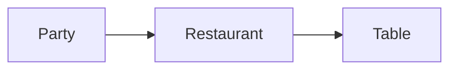

管理進來的 Party/Table

- What : 
  - Restaurant
    - 吧台
      - 怎麼分一個Party
    - 固定Table
    - 包間
    - 大小、收費？！
  - Party
  - Table
  - 針對本題：
    - 大堂，所有桌子都一樣


- How ：
  - 能否送外賣？
  - 能否預定某張桌子？
  - 每個Order 需要區分是內用還是外帶？
  - 針對本題：
    - 無外賣、都內用 dine-in無Dine-out


- Who:
  - List<Guest>
  - Party -- 日上size，不需要去紀錄Guest，淡化Guest的概念
  - 思考一：
    - 一組人進餐廳，帶位人帶位，waiter、客人點菜、廚師做菜、waiter 上菜，客人買單。
    - ***不同角色的流程，很複雜***　比較像菜廳的遊戲，費時，易有小bug
  - 思考二：
    - 以餐廳為主體
      - 客人進餐廳，餐廳返回一個Table
      - 客人點菜，餐廳返回一桌菜
      - 客人付帳，餐廳清空Table
      - 對於這個餐廳的Use Case，每個Use Case自對應input/output


## Core Object

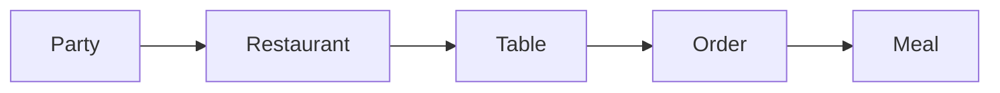

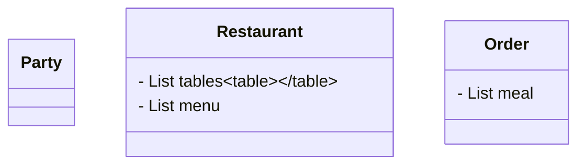

## Cases

- Party
  - make order?! X 主體最要用餐廳
- Restaurant: 
  - Find table
  - Take Order -- 等效以restaurant 去想Party 的MakeOrder
  - Checkout


- Management 類常見 Use Case
  - Reserve: 暫不考慮
  - Serve: Find table, take order
  - Checkout: checkout


## Class

| Use Cases  |
| :--------: |
| find table |
| Take Order |
|  Checkout  |


### Use Case: SEARCH - Find Table

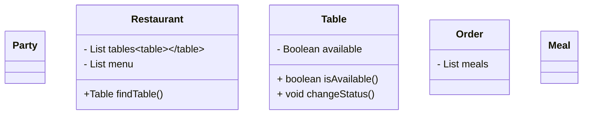

- changeStatus 並不是個好的名字！！因為別人要去查之前的狀態，比較好的是↓

- 變成有兩個一個叫 MarkAvaible, 一個叫 MarkUnavailable. 是更好的

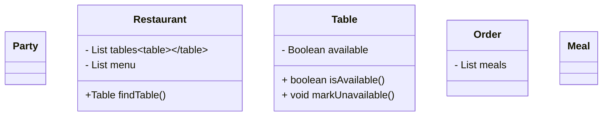


### Use Case: SELECT - Take Order

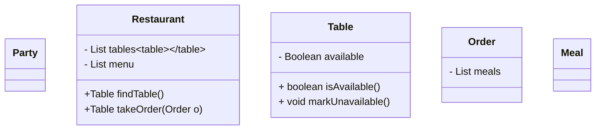

- takeOrder 放在Restaurant　或放 Table都OK...

- OOD考慮的人物愈多，愈複雜，所以用主題：這個restaurant就好


### Use Case: CANCEL - Checkout

- 把桌子設回去可用
- 結帳

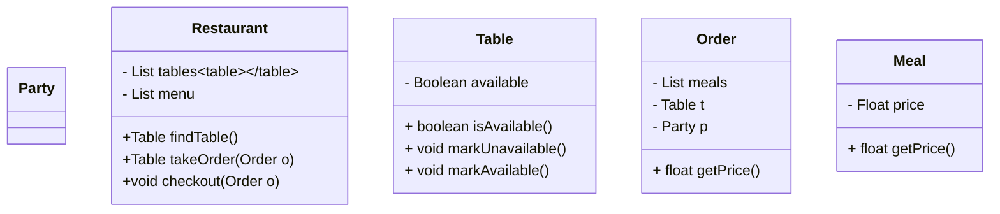

- Order要知道是幾號桌去作mark
- 能不能在Table 加 Order?
  - 不好！如同往Spot或Vehicle加Ticket，靜態加動態不好！
- Order 可加Party嗎？
  - 好！就是個Ticket!

- 可以解決拼桌的問題嗎？目前可以嗎？
  - 無法
  - 拼桌是看Table是不是Available? 當我們調 findTable後，還能不能再坐人要看Table、Party大小，都不知道
  - 多個Party用一張桌子
  - 一個Party用多張
  - Available vs Unavailable
    - 做法一、在restaurant 加map

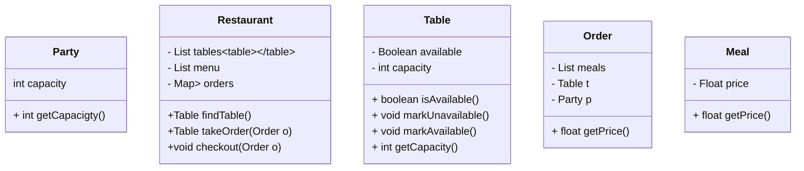

​					   		或做法二更好、也可以在 Table加 capacity & cur_capacity 用 cur_capacity来看還能不能塞人。如果 cur_capacity到0了，就設為unavaialable；每次有人坐進來就控制個variable

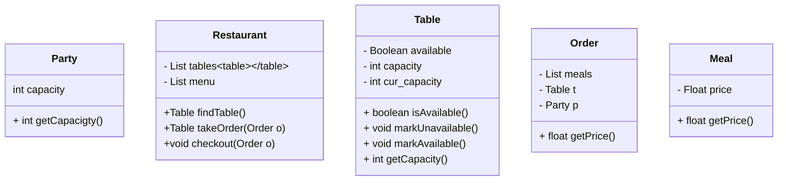

- 
  - 最方便來想，就是把所有都放在 restaurant主來 來完成。
  - 如果是一群人多桌的話，就是還要再Order裡把 Table t 改為 List<Table>


# Reservation?!!

-  Restaurant、Hotel、Flight/Bus/Train

- 基於管理類作提升

- What?

  - 考慮預定的東西
  - Table
  - 時間段 + Table
  - 機票/機艙/座位號

- Use Case

  - Search

  - Select

  - Cancel

  - **Search criteria** -> Search() -> **List<Result>** -> Select() -> **Receipt**

    - Search criteria
      - Make a reservation
        - Party 大小
        - 日期
        - 時間
      - 人數：無拼桌，每張桌子大戚相同，不會有超過桌子大小的人數
      - 日期：是否允許預定多日後？ - Ok
      - 時間：是否所有時間都允許預定？不行就要加Exception  - 24/7
        - 時間段是比起始時間好做

  - Design: FindTableForReservation(Timeslot t)

  - Timeslot: Date & Time

  - List<Result>

    - 當選的時間段可以或不行時，系統該給出什麼反饋？
      - 做法一：
        - 7:30可選，還給附近的時間讓你選
        - Result == Timeslot
        - -Design: List<Timeslot> findTableForReservation(Timeslot t)
        - Possible Challenge: 討論如何獲得這個List，像是給出前後還有它的這個List
      - 做了二：
        - 可預定: 直接進入Confirm階段
        - 不能預定 ：Throw exception/ Show message
        - -Design: Pair<Table, Timeslot> findTableForReservation(Time slot), or throws NoTableForReservationException
        - -Design: void confirmReservation(Pair<Table, Timeslot> reservation)
        - 為何可以跳過 List<Result>這個步驟？因為Table是一樣的，用戶不會知道是幾號桌

    

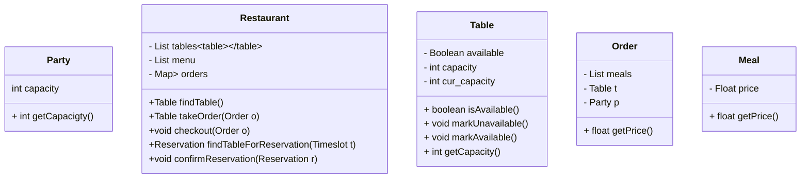

> Restaurant: +Reservation findTableForReservation(Timeslot t) //SEARCH
> Restaurant: +void confirmReservation(Reservation r)  //SELECT	

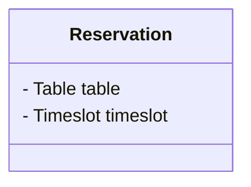

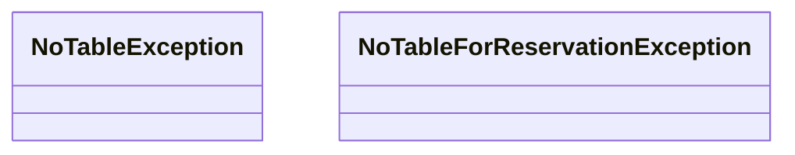

- 怎麼判斷哪張Table被預定／是否能被預定呢？

  - How to know if a table if open for reservation for a time slot?

  ```
  　　　　４　　　　　　２　　　　　　　　１
  if (Timeslot-MAX_DINETIME > CURRENT_TIME)｛
  　　　　　　　　　　　　　　　　　　４　　　　　　　２
  	if no reservation durint Timeslot-MAX_DINETIME to Timeslot+MAX_DINETIME
  		return True;
  	else
  		return False;
  }
  else{
  	return table.isAvailable()
  }
  ```

  - 講解：如果要預約的間是四點，尤其一桌可吃的最長是兩小時，我們就看前後兩小時有沒有人預定，要2點到6點之間都沒人預定，4點這個timeslot才能被預定；三點或五點有人預定，這桌子都不可被預定
  - 如果當前時間已經這時間內了，就看是否有人在用在三點已有人預定
  - PS: 這頁還是怪怪的，要是現在是 2:30，有人預約三點，但你只看現在沒人在用餐，這樣不對吧？！！。。
  - 另種方法：用時間段預約如 9:30 ~ 11:00，就不用設計 MAX_DINE_TIME

- 如何知道對於一張Table *Any reservation durint Timeslot-MAX_DINETIME to Timeslot+MAX_DINETIME?*

  - Solution1: 每張Table 按時間排序保留一個 List, 對於每個進來的query的Timeslot都檢查是否有符合上述區間的timeslot已經被預定了

    - 例：[2, 7, 9], 那麼4點就可預定，因為他可用到六點；而8無法被預定（因為6點到10點有沒有人預定，發現了7、９都有人，所以8點無法） 
      - Walkin有什麼影響？要查是否預定

  - Solution2: 保存一個Centralzed的Map, 有被confirm過的time splot就插入這個Map, Map<Timeslot, Set<Table>>

    - 當Query一個新的timesplot時，檢查這個區間內已經被預管過的Table,

      排除之後剩下的就是可選的桌子，隨意選一張即可

    - 例如 (2, <1,3,5>), (3, <4.,6>)，當要查４點時，就是看2-4點，還有4-6還被預定過的求交集，剩下的就是可用的桌子

  - Sol1, vs Sol2, 

    - sol1, 不好清空所有Reservation
    - Sol2. 如果Timesplot分很細，會有很多的key，就要找很多個去看這「兩個小時裡是否有空位」

- 多線程設計：要找到critical data, 這題就是”Table"，有好多Thread都要去訪問它看是不是available

​	

- Sol1:  UML，去看這張桌子的revervation list

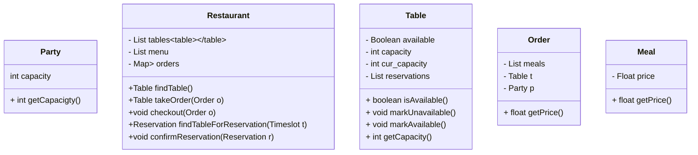


- Sol2:  UML，中心化 reservation在Restaurant

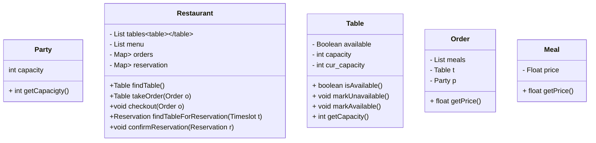


### Use Case: Cancel Reservation

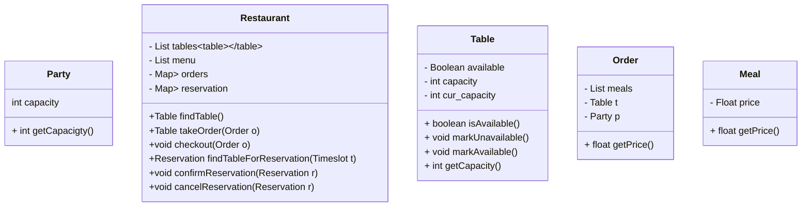


# Hotel Reservation

所有預定系統都有兩種潛在型問題：

1. 像Booking.com找一個地區的hotel
2. 蒐的是某個具體的hotel得到詳細內容，直接針對一間hotel作預定


- What? 是為一間設計還是Booking?

  - 先設計一間，再設計選擇酒店的系統，方間的人數和價格可能不同
  - What 針對的是 Search()後的 List<Result>
  - 關鍵字: Room

- Challenge

  - 設計房間類

    ```mermaid
    classDiagram
    	class Room{
    		- int capacity
    		- float price
    	}
    ```

  - 如果Result是Room: List<Result> -> List<Room>

    - 跟現實不一樣，現實返回的是 RoomType

  - How many room types do we have for this hotel?

- Restaurant V.S. Hotel

  - 什麼情況下需要考慮 Result Type (Room Type)?
  - 主要是在價格、很多屬性不同時
    - 單人 vs 雙人
    - 頭等 vs 經濟
    - 大桌 vs 小桌


## Clarify

- 預等類的規則？N/A
- 當人滿教超過房間大小怎辦？
  - 用戶自己選房間數量
    - 外部自主發Request


## Core ObjectType

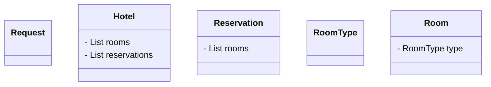

## Classes

### Use Cases

- Hotel: 
  - Search for available rooms
  - Make reservation (SELECT)
  - Cancel reservation


- Search for available roome
  1. Based on serach criteria
  2. Go thru rooms to check availability
  3. list available **room types** and **available count**
  4. P.S. 不加人數沒影響，人數少以定總統房也OK

1. 

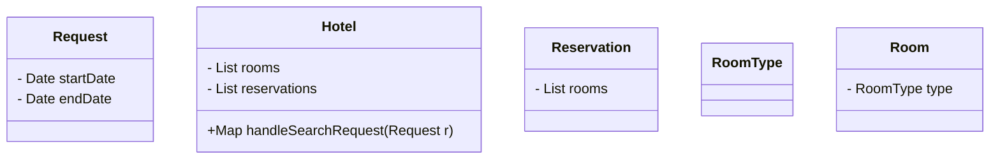


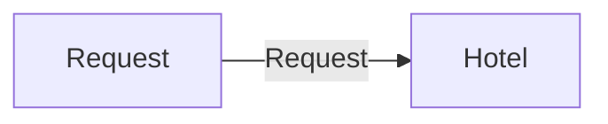


2. 加個 List<Data>　單位都是 Date, 對於Hotel可能不需要再多寫 isRequestAvailable

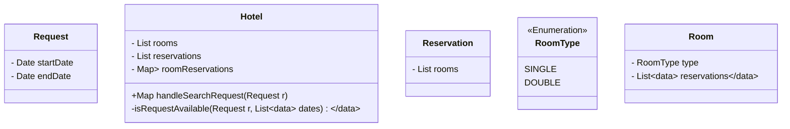

- Make Reservation (SELECT)
  1. Add room type and number of rooms in a request
  2. send request to hotel  ==> API
  3. if there's enough room left, confirm
  4. not enough, throw exception

1.


```mermaid
classDiagram
	ReservationRequest --> Hotel: SendRequest
	class ReservationRequest{
		- Date startDate
		- Date endDate
		- Map<RoomType, int> roomsMNeede
	}
	
	class Hotel{
		- List<Room> rooms
		- List<Reservation> reservations
		- Map<Room, List<Data>> roomReservations
		Hotel: +Map<RoomType, int> handleSearchRequest(Request r)
		Hotel: -Boolean isRequestAvailable(Request r, List<Data> dates)	
		Hotel: + Reservation makeReservation(ReservationRqeust r)
	}	
	
```

```mermaid
classDiagram
	class NotEnoughRoomForReservationException{
	
	}
```

- 根據 roomReservations 再去看各類房型還有多少房, 或不夠


| Search for available rooms                       | Make reservation                                            |
| ------------------------------------------------ | ----------------------------------------------------------- |
| 1. Based on search criteria                      | 1. Add RoomType and number of  rooms in a request           |
| **2. Go thru rooms to check availability**       | 2. Send request to Hotel                                    |
| **3. list available room types and room count**. | **3. If there's enough room left, confirm the reservation** |
|                                                  | 4. if not, throw **exception**                              |

- 上面的黑體會被這兩個Use Cases常調用
- Challenge
  - Map<RoomType, List<Room>> map
  - Go thru, to check availability
  - Room enough then confirm
  - Not enough , throw exception
  - 用 Cache!! for 這種預定類常見的蒐索
    - LRU Cache!   Heavily Search Service
    - e.g. 已經保存了３～４號有100間房，有人訂了，就更新成98間，是一個Hash表，不需再全部過一遍。
      - Multithread會有沒有不妥？LRU每個cell都是critical data，需要把這個data structure加上鎖
      - Java 裡提供了 LinkedHashMap, 聲明Capacity即可

#### LRU

```mermaid
classDiagram
	ReservationRequest --> Hotel: SendRequest

	class ReservationRequest{
		- Date startDate
		- Date endDate
		- Map<RoomType, int> roomsMNeede
		- LRUCache<Request, Map<RoomType, Set<Room>>> Cache
	}
	
	class Hotel{
		- List<Room> rooms
		- List<Reservation> reservations
		- Map<Room, List<Data>> roomReservations
		Hotel: +Map<RoomType, int> handleSearchRequest(Request r)
		Hotel: -Boolean isRequestAvailable(Request r, List<Data> dates)	
		Hotel: + Reservation makeReservation(ReservationRqeust r)
		Hotel: + void cancelReservation(Reservation r)		
	}	

```

- **過來的request就是1到３號，我返回單雙人間各還有哪幾間**
- 得知道哪些是Available的，以及「返回型式」該是怎樣的


## v.s. Booking.com ?!

區別在 Formula 


- Search B 是 A的子集