# Real Obj OOD

- Vending Machine
- Jukebox 點菜機
- CD Player
- Coffee maker
- Kindle
- ***ATM***


- Input / Output

  ```mermaid
  graph LR
  	CoffeeBean --> CoffeeMaker --> Coffee
  ```

- Design Pattern - 大多數實物類都可用到
  - Strategy pattern
  - Decorate pattern
  - Factory pattern


# Design a Vending Machine

## Clarify

- What: 
  
  - Input ? Output ? & 該如何提問這兩者?
  
  - External request?! ==> 包含 **($, item)** 這樣先後順序沒有能體現
  
  - 不需要提廠家、重量、顏色這些的只是加了private attribute等等的 getter，這些並不是影響設計的流程，只是「通用屬性的點」，浪費了時間; 大小是否有限制？--> 也不是要注意的點
  
  - Input: 
  
    - Payment
      - 不同***種類***的錢？！
        - 紙/硬幣
          - 找零
        - CreditCard/ApplePay..
  
    ```mermaid
    graph LR
    	Payment --> VendingMachine --> Item		 
    ```
  
    - Item
      - What to do when an item ***sold out***?
        - refill sue case ==> **ItemSoldOutException**
  
  - 假設：
    - Vending Machine 大小沒限制
    - 只賣三種產品；Coke, Sprite, Mountain Dew
    - 目前只可coins，不考慮payments所以沒有 Strategy Design 
  
- How: 
  - how to select item ? 
  - 假設：
    - 輸入一個input，代表一種item: A1 -> Coke
  - Refill
  
- Who: N/A


## Core Object

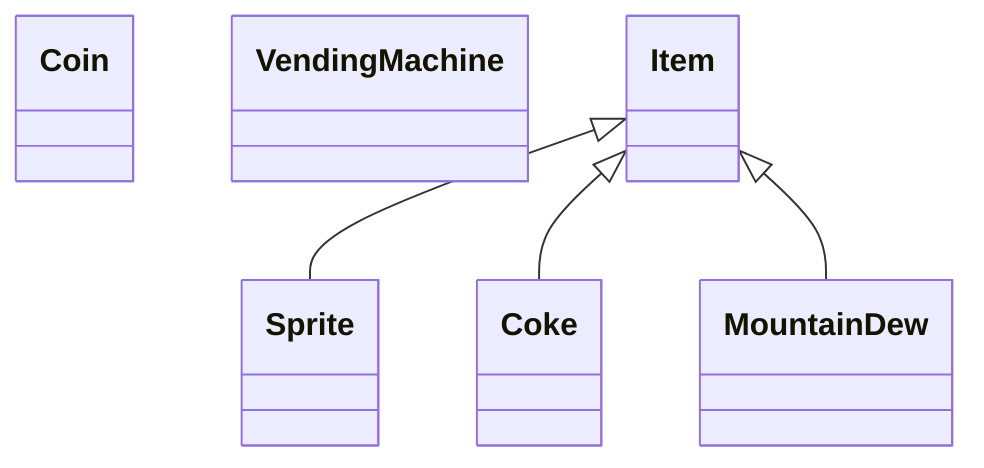


### Use Cases

|      Use Cases      |
| :-----------------: |
|     Select Item     |
|     Insert Coin     |
| Execute Transaction |
| Cancel Transaction  |
|    Refill Items     |


### Classes

#### Use case: Select item

​	- Vending machine taks an external input, show the price of that item

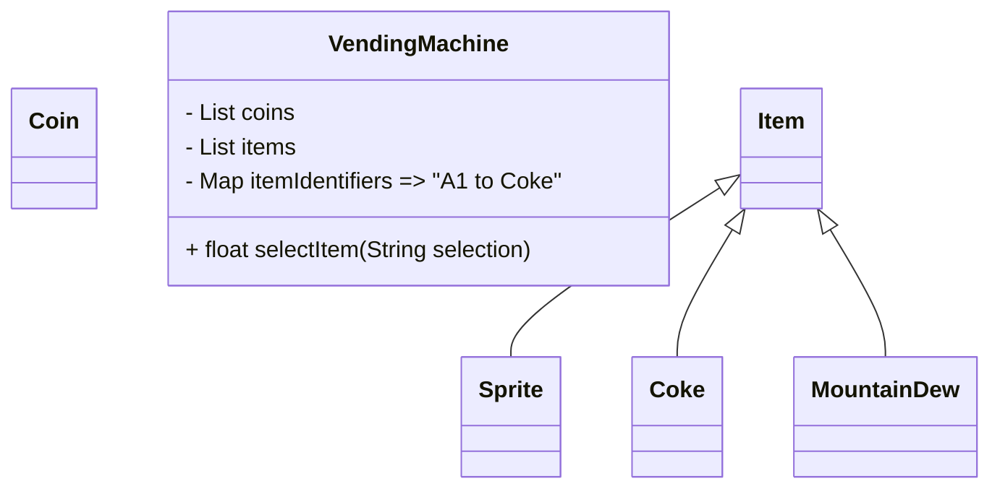

- 問題: 

  - itemIdentifiers 的問題：

    - item 沒有價格，再加上去 屬性吧

    - Item 不存在的話？如E2, 加Exception

    - sold out?

    - ☆★☆★☆ ItemIdentifier是個靜態，item是動態的，如果客人把 Coke destroy，那我們的機器就被影響了！！動態的物品被買走後，別人對item做的變動我們不能保證，所以不能這樣做

      ```mermaid
      classDiagram
      	class ItemInfo
      ```

      應該是要對到一個靜態的 ***ItemInfo***

      並用ItemInfo映射到 List<Item>


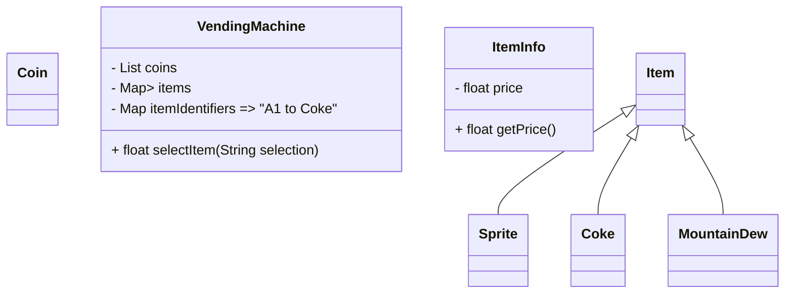

​						修改價錢時，直接對應到所有的Item上去了！

- 現在是先選，再投幣


#### 	Use Case: Execute Transaction

- Get current selected item
- Cpr the item price and inserted coins
- If not enough money, throw an exeption
- Else, return the item purchased
- Refund if any


1. & 2. Cur selection & inserted coins

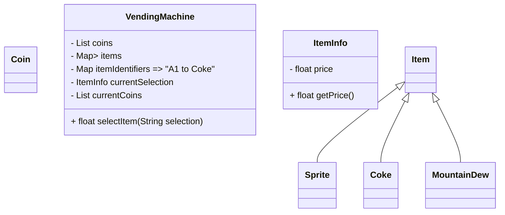

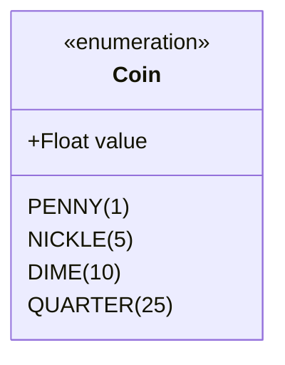

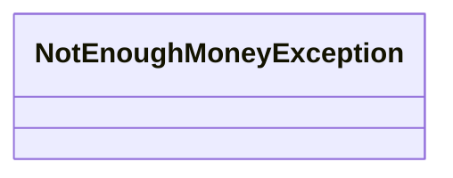


SelectItems 已經把東西選好了，所以executeTransaction可以執行，而不用再有input，前面做了可以顯示，不綁定在executeTransaction裡

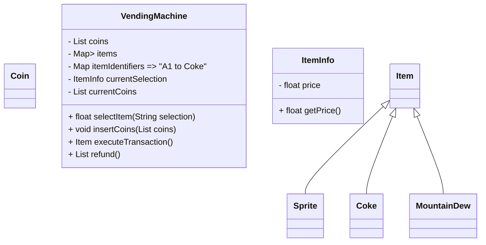

找零 + 東西出來


#### Use Case: Cancel Selection & Refill

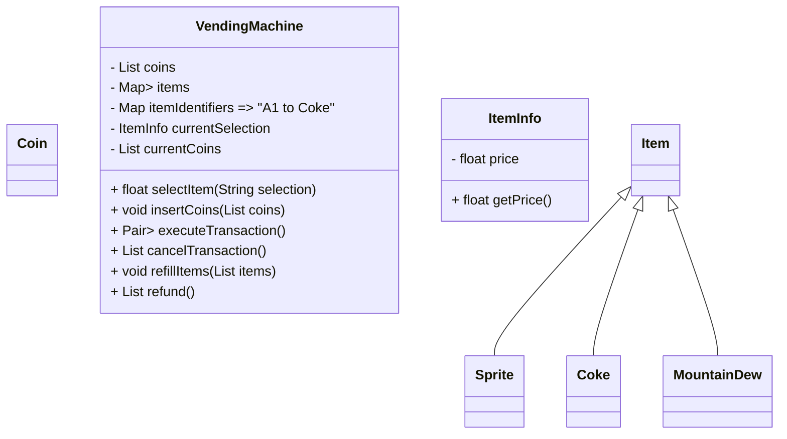


#### Use Case: Final View

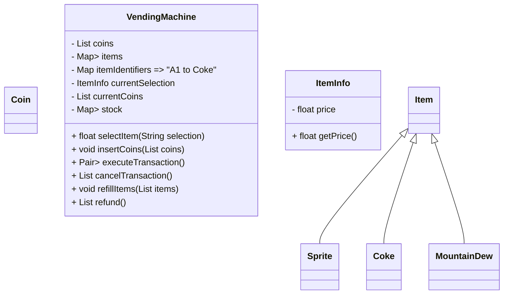


####  GOOD PRACTICE for NESTED ITEMs

For example:

```java
stock = new HashMap<ItemInfo, List<Item>>();

public void refillItem(List<Item> items){
  for (Item item: items){
    ItemInfo info = item.getInfo();
    List<Item> itemsInStock = stock.get(info);
    itemsInSotck.add(item);
    stock.put(info, itemsInStock);
  }
}
```


當遇到Nested-Structure時，可以用一個類去代替　↓

```java
class Stock{}
	private HashMap<ItemInfo, List<Item>> stock;

	public void add(Item item){
    ItemInfo info = item.getInfo();
    List<Item> itemsInStock = stock.get(info);
    itemsInStock.add(item);
    stock.put(info, itemsInStock);
  }
}

stock = new Stock();
public void refillItem(List<Item> items){
  for (Item item: items){
    stock.add(item);
  }
}
```


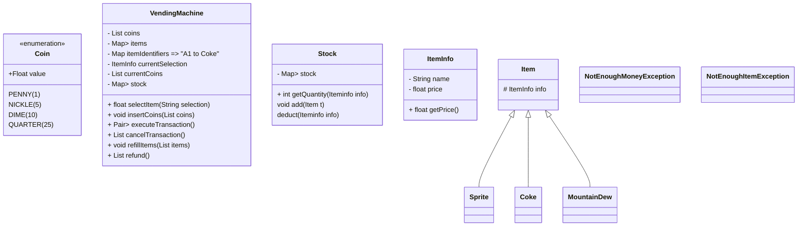

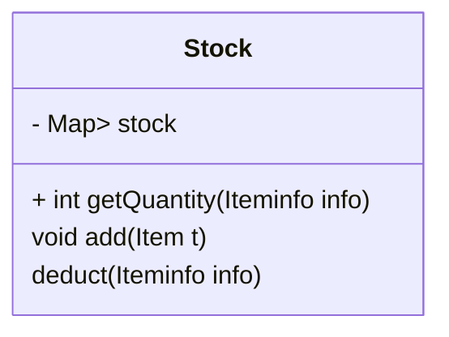

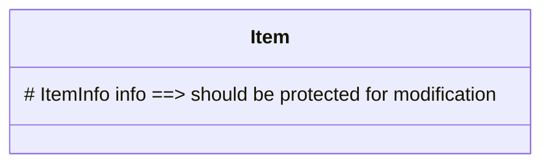

