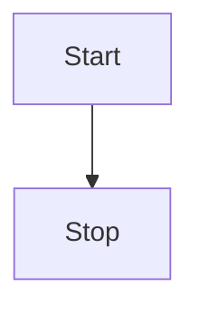
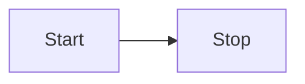
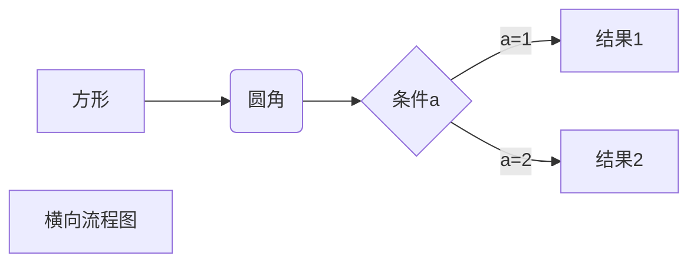
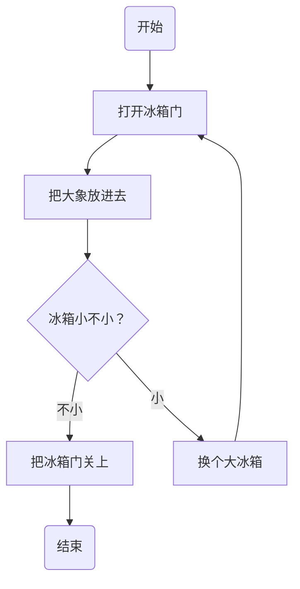

```mermaid
graph TB
    Start --> Stop
```

```mermaid
graph LR
    Start --> Stop
```

```mermaid
graph LR
A[方形] -->B(圆角)
    B --> C{条件a}
    C -->|a=1| D[结果1]
    C -->|a=2| E[结果2]
    F[横向流程图]
```

```mermaid
graph TB
    Start(开始) --> Open[打开冰箱门]
    Open --> Put[把大象放进去]
    Put[把大象放进去] --> IsFit{"冰箱小不小？"}
    
    IsFit -->|不小| Close[把冰箱门关上]
    Close --> End(结束)
        
    IsFit -->|小| Change[换个大冰箱]
    Change --> Open
```

ref: https://jingyan.baidu.com/article/48b558e3035d9a7f38c09aeb.html

live: https://mermaid-js.github.io/mermaid-live-editor/